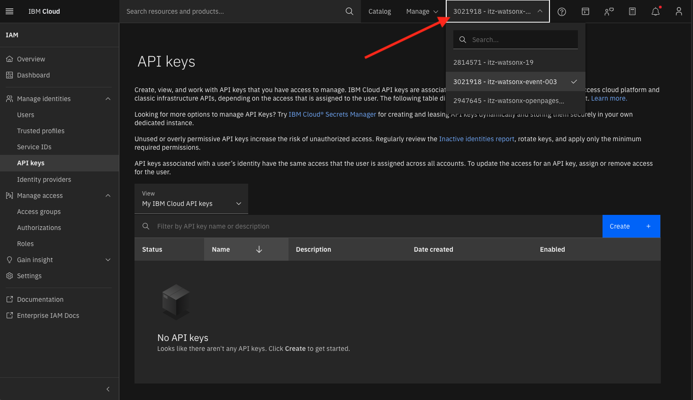
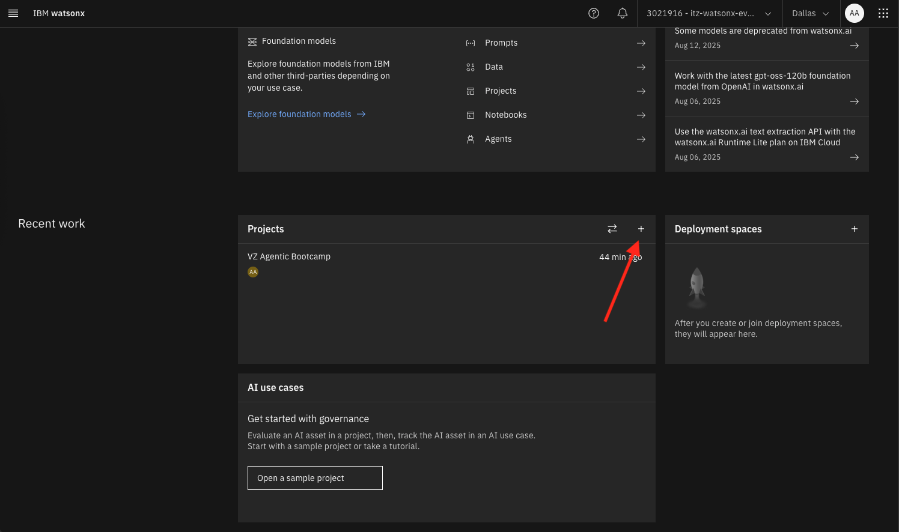

# Use case: NOC Supervisor Assistant

## Table of Contents

- [Use case: NOC Supervisor Assistant](#use-case-noc-supervisor-assistant)  
  - [Table of Contents](#table-of-contents)  
  - [Introduction](#introduction)  
    - [Pre-requisites](#pre-requisites)  
  - [Watsonx Orchestrate (SaaS)](#watsonx-orchestrate-saas)  
    - [Environment Setup](#environment-setup)  
    - [AI Agent Configuration](#ai-agent-configuration)  
    - [The Network Status Agent](#the-network-status-agent)  
    - [The Server Status Agent](#the-server-status-agent)  
    - [The Incident Diagnosis Agent](#the-incident-diagnosis-agent)  
    - [The Communications Agent](#the-communications-agent)  
    - [The NOC Supervisor Agent](#the-noc-supervisor-agent)  
  - [Summary](#summary) 

## Introduction  

This use case describes a scenario where a Network Operations Center (NOC) Supervisor leverages an AI assistant through a natural language chat interface to investigate, diagnose, and resolve service disruptions. The assistant acts as a central routing point that selects the appropriate specialized agent to satisfy each request, ensuring rapid coordination across tools and knowledge sources.  

Agents can be configured in the system to address specific needs of the NOC. Each agent is powered by a Large Language Model (LLM) with function-calling capabilities, enabling it to invoke the right tools or knowledge bases based on the task description.  

In our scenario, we will build agents for **Network Status**, **Server Status**, **Incident Diagnosis**, and **Communications**, all coordinated by a **Supervisor Agent**. This setup allows the NOC Supervisor to ask questions in plain language, such as checking server health, investigating site-specific outages, diagnosing root causes, and drafting updates for field teams.  

There is an argument to be made that a truly agentic solution would demonstrate a high degree of autonomy. In such a setup, the system itself could monitor alerts, analyze logs, determine the root cause, generate a remediation plan, and notify stakeholders — all without human intervention. However, we can also maintain a **“human in the loop”** approach, where the NOC Supervisor drives the workflow step by step, verifying outputs from each agent before proceeding to the next stage. This flexibility allows organizations to balance automation with oversight.  

<div style="border: 2px solid black; padding: 10px;">
Even though we will take you through a complete and working example, you should also consider making changes that fit your desired use case, and only take this description as a reference point that guides you along your own implementation.
</div>  

### Pre-requisites  

Before starting the lab, make sure you have the following installed and configured on your system:  

1. **Python 3.11**  
   - Download from [python.org](https://www.python.org/downloads/release/python-3110/).  
   - Verify installation:  
     ```bash
     python3 --version
     ```  

2. **Git**  
   - Download from [git-scm.com](https://git-scm.com/downloads).  
   - Verify installation:  
     ```bash
     git --version
     ```  

3. **Visual Studio Code (VS Code)**  
   - Download from [code.visualstudio.com](https://code.visualstudio.com/).  
   - Install recommended extensions:  
     - *Python* (for coding and debugging).  
     - *YAML* (for agent and tool configuration files).  

Once these prerequisites are installed, you will be ready to set up the environment and import agents into watsonx Orchestrate.  

- Check with your instructor to make sure **all systems** are up and running before you continue.  
- If you're an instructor running this lab, check the **Instructor's guides** to set up all environments and systems.  

## Watsonx Orchestrate (SaaS)

Watsonx Orchestrate (wxo) is IBM’s SaaS-based platform for creating, managing, and running AI-driven digital workers and agentic flows.  
In this bootcamp, you will use the SaaS version of Orchestrate to configure agents, tools, and knowledge sources directly from the web console, without needing to provision infrastructure yourself.  

Key concepts to keep in mind:  

- **Console Access**:  
  You will log into the Watsonx Orchestrate console using your IBMid. All agent testing and orchestration will happen here.  

- **Agents**:  
  Each agent encapsulates a role — for example, the *Network Status Agent* queries site/network health, while the *Incident Diagnosis Agent* analyzes logs and suggests root causes.  

- **Tools**:  
  Tools are Python or API-based functions that agents can call (e.g., checking server status or parsing network logs).  

- **Knowledge Sources**:  
  Data sources that provide structured domain-specific information through a vectore store (e.g., site network status data)

### Environment Setup

(Information about IBMid and cloud account)

#### Working Locally on the Repository

- Run the following command below to clone the repository. This will give you the foundational resources to complete the bootcamp.

```bash
  git clone https://github.com/Aditya-Asthana/ai-agentic-bootcamp-vz.git
```  

- Now open the project folder in vscode, and navigate to the terminal within the project directory.


- Once you the terminal appears on your screen, ensure you are in the folder where the contents of the repo live. Now type in the following commnads line by line:

```bash
  python3.11 -m venv bootcamp_venv
  source bootcamp_venv/bin/activate
  pip install ibm-watsonx-orchestrate
```  

Here, we are creating a virtual environment for our dependencies to live. This allows our agents to work in an isolated workspace with out the interference of other global Python libraries on your device. After, we install the SaaS version of Watsonx Orchestrate so we can import our future agents and tools through the CLI.

- Now we will rename our `.env_example` to `.env` through vscode. To do so, click on the pages icon on the left side and find the `.env_example` file. Right click on the file and rename it to `.env`. This will be a place where we store our credentials so that we can connect to Watsonx Orchestrate.

#### API Key

1. Go to the [IBM cloud console](https://cloud.ibm.com/) and ensure the right cloud account is selected through the dropdown. Check TechZone to confirm what cloud account you should be in.



2. Click the **Manage** Dropdown on the top right and click into **Access (IAM)**.


3. Next, on the vertical menu on the left hand side of the screen, click into the **API keys** tab. Then click the blue **Create +** button on the side and name the key. Leave the default configurations as is and click **create**. **Make sure to copy the API key to your clipboard as you can only see this once!**




4. Now go back into vscode and find the `.env` file. Paste the API key into the variable that says `WO_API_KEY`.

#### Service Instance URL

